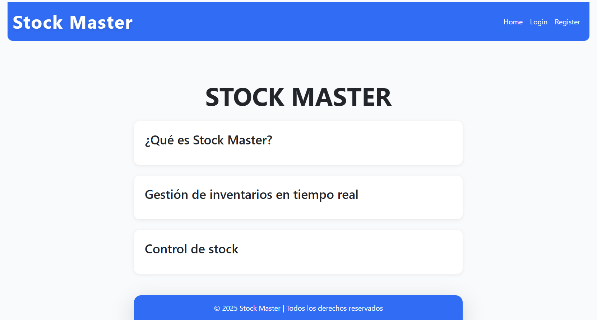
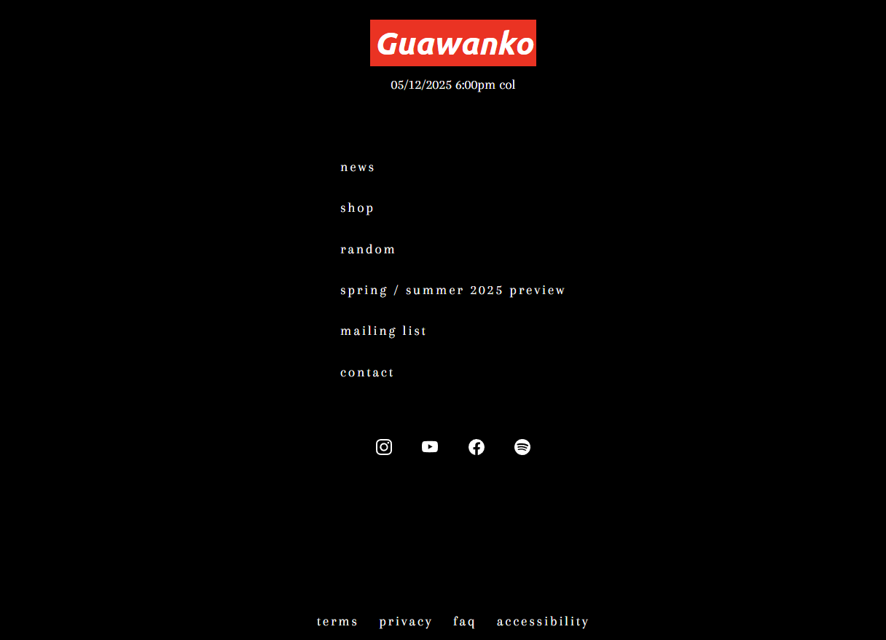
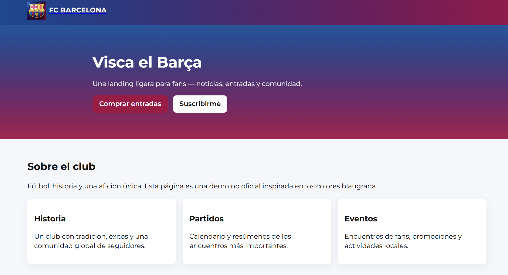
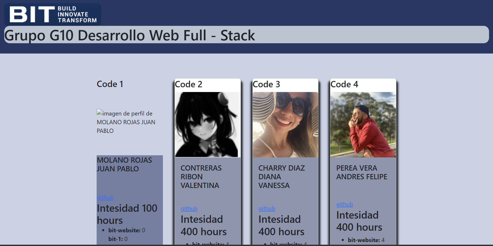

# Portafolio_Jaderson_Perez

   STOCK MASTER: Proyecto práctico para integrar backend y frontend con infraestructura en la nube usando EC2 y S3.
   - Aplicación sencilla de inventario desplegada en AWS usando EC2 y S3.
   - Aplicación CRUD de inventarios con despliegue cloud en Amazon Web Services.
   - Inventario básico con backend en EC2 y almacenamiento de archivos estaticos o respaldos en S3.
    Tecnologias usadas: Node.js / Express / MongoDB / MobaXterm / Jest
    Captura:
    Enlase del Demo:http://s3-1006553726.s3-website-us-east-1.amazonaws.com/

   Organizador de Tareas.
   - Gestor simple de tareas con funciones básicas de agregar, editar y eliminar.
   - Aplicación minimalista para organizar pendientes de forma rápida.
    Tecnologias usadas: HTML / CSS / JavaScript
    Captura:
    Enlase del Demo:https://jaderson-barrera.github.io/Organi|zador_de_Tareas/
   
   Calculadora básica con operaciones aritméticas esenciales.
   - App sencilla para sumar, restar, multiplicar y dividir.
   - Calculadora funcional con interfaz clara y lógica directa.
    Tecnologias usadas: HTML / CSS / JavaScript
    Captura:
    Enlase del Demo:https://jaderson-barrera.github.io/Calculadora1/

   Guawanko: Proyecto práctico para mejorar habilidades en maquetación, CSS y diseño web moderno.
   - Replica visual de la página oficial de Supreme con diseño responsivo.
   - Imitación de Supreme con maquetación precisa y estética original.
    Tecnologias usadas: HTML / CSS / JavaScript / Figma
    Captura:
    Enlase del Demo:https://jaderson-barrera.github.io/bit-1/

   Landing Page FC Barcelona: Proyecto práctico para mejorar habilidades en HTML, CSS y diseño visual temático.
   - Landing page inspirada en el FC Barcelona con diseño visual y estructura responsiva.
   - Página de presentación del FC Barcelona con enfoque en estilo, colores y navegación.
    Tecnologias usadas: HTML / CSS / JavaScript / Figma
    Captura:
    Enlase del Demo:https://jaderson-barrera.github.io/Landing_FC_Barcelona/

   BIT Estudiantes: Proyecto práctico para integrar frontend con APIs REST y manejar datos dinámicos de estudiantes.
   - Aplicación que consume una API para mostrar datos de estudiantes (Nombre - intensidad - notas - foto de perfil y codigo) en tiempo real.
    Tecnologias usadas: HTML / CSS / JavaScript
    Captura:
    Enlase del Demo:https://jaderson-barrera.github.io/bit-2/

📫 Contacto

- 📧 perezbarrera098@gmail.com  
- 💼 [LinkedIn](https://www.linkedin.com/in/jaderson-geovanny-perez-barrera-92973a366/)